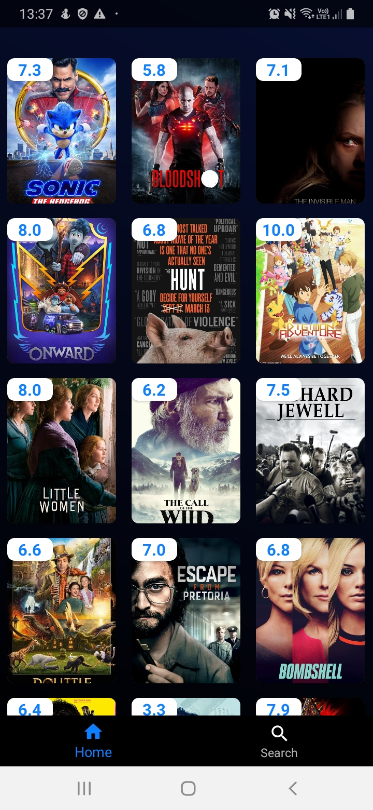
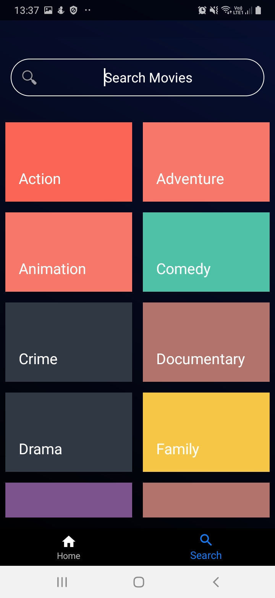
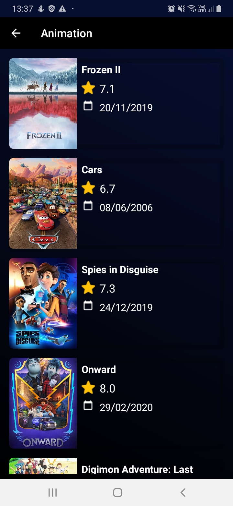
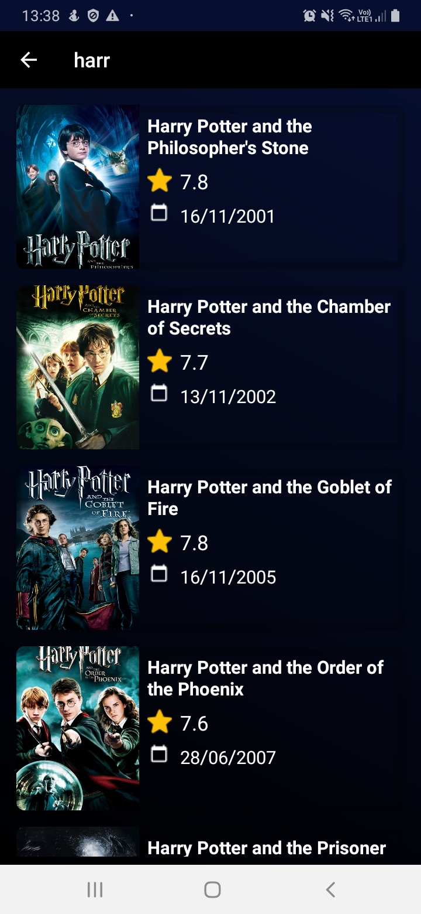

<h1 align="center">
    Upcoming Movies
</h1>

    List of upcoming and search movies on TheMovieDb API

## Screenshots

  
  
  

  
  

## Features

- MVVM
- Endless list of movies upcoming
- Movie detail
- Search by text
- Search by genre
- Persist movie details
- Get movies from roomDb when offline

## Libs

- [Kotlin](https://kotlinlang.org/)
- [LiveData](https://developer.android.com/topic/libraries/architecture/livedata)
- [Navigation](https://developer.android.com/topic/libraries/architecture/navigation)
- [ViewModel](https://developer.android.com/topic/libraries/architecture/viewmodel)
- [Retrofit](https://square.github.io/retrofit/)
- [Room](https://developer.android.com/topic/libraries/architecture/room)
- [Databinding](https://developer.android.com/topic/libraries/data-binding)

## API

- [Themoviedb](https://developers.themoviedb.org/3)
